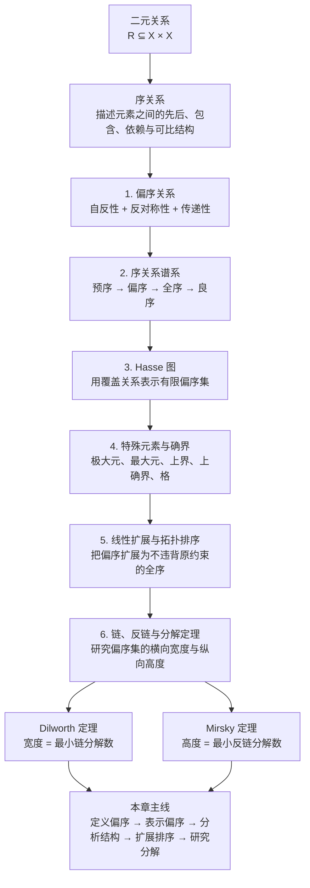

# 离散数学 · 序关系 学习笔记

## 前言：

在“关系”这一章中，我们已经知道：**二元关系**本质上是笛卡尔积的子集，即

$$
R \subseteq X \times X.
$$

这意味着，只要给定集合 $X$，我们就可以用 $R$ 描述元素之间的某种结构。

前面学过的**等价关系**使用

$$
\text{自反性}+\text{对称性}+\text{传递性}
$$

来刻画“哪些元素可以归为同一类”。它的核心思想是：**分类、抽象、形成商集**。

而**序关系**研究的是另一类结构：不是把元素归并成类，而是判断元素之间是否存在某种“先后、包含、整除、依赖”等形式化关系。更准确地说，序关系把直观的“这个不大于那个”“这个先于那个”“这个包含在那个里面”转化为满足特定公理的二元关系。

于是我们引入**序关系**，它的核心是把等价关系的“对称性”替换为“反对称性”。本章的学习思路是：

1. **偏序到全序**：先建立最广泛的“偏序”（部分元素可比），再逐步增加条件得到“全序”（任意两个元素可比），最后研究更强的“良序”。
2. **抽象形式到直观图形**：通过**Hasse 图**将偏序可视化，在此基础上分析偏序集中的特殊元素（极大元、上下确界等）。
3. **结构，分解分析**：引入链与反链的概念，证明 **Dilworth 定理**（宽度 = 最小链分解数），并将其应用于经典组合学问题（Erdős–Szekeres 定理）。


---

## 目录

| 章节 | 标题 | 本节主要内容 |
| :---: | :--- | :--- |
| 1 | 序关系的引入 | 从等价关系出发，引入序关系的基本思想，说明序关系用于刻画元素之间的先后、包含、依赖与可比结构。 |
| 2 | 偏序关系 | 定义偏序与严格偏序，说明自反性、反对称性、传递性，以及非严格偏序与严格偏序之间的相互转换。 |
| 3 | 序关系的谱系 | 梳理预序、偏序、全序、严格全序与良序之间的层级关系，理解不同序结构由哪些公理刻画。 |
| 4 | Hasse 图与覆盖关系 | 介绍覆盖关系与 Hasse 图的绘制规则，说明如何通过向上路径判断偏序集中两个元素之间的关系。 |
| 5 | 特殊元素：极大、最大、界与确界 | 分析极大元、最大元、极小元、最小元、上界、下界、上确界、下确界与格等核心概念。 |
| 6 | 线性扩展与拓扑排序 | 说明如何将有限偏序集扩展为全序，并用拓扑排序解释线性扩展的构造过程。 |
| 7 | 良序 | 定义良序集，说明良序与全序的关系，并介绍有限全序、良序定理与选择公理之间的联系。 |
| 8 | 链、反链与 Dilworth 定理 | 研究偏序集中的链、反链、宽度、高度、链分解，以及 Dilworth 定理和 Mirsky 定理。 |
| 9 | 总结：层级图 | 层级图与注意 |

---

## 1. 序关系的引入


等价关系满足自反、对称、传递；若我们保留自反和传递，但把对称改为**反对称**，就得到了刻画“顺序”的工具。

正如Wikipedia 说：“序理论提供了一套形式框架，用以描述诸如‘这个小于那个’或‘这个先于那个’的陈述。”序关系的研究对象是**集合上的二元关系**，关注元素之间的层级、先后、大小等特征。

---

## 2. 偏序关系

### 2.1 偏序的定义

**定义一（偏序关系）**  
设 $\preccurlyeq \subseteq X \times X$ 是 $X$ 上的二元关系。若满足：

1. **自反性**：$\forall x \in X.\; x \preccurlyeq x$。
2. **反对称性**：$\forall x, y \in X.\; (x \preccurlyeq y \land y \preccurlyeq x) \to x = y$。
3. **传递性**：$\forall x, y, z \in X.\; (x \preccurlyeq y \land y \preccurlyeq z) \to x \preccurlyeq z$。

则称 $\preccurlyeq$ 为 $X$ 上的**偏序**，$(X, \preccurlyeq)$ 称为一个**偏序集**。

同时定义严格偏序：$x \prec y \triangleq x \preccurlyeq y \land x \neq y$。

### 2.2 偏序的例子

1. **整除偏序**  
设 $X = \{1,2,3,4,5,6,10,12,15,20,30,60\}$，定义 $a \preceq b \iff a \mid b$（$a$ 整除 $b$）。
则 $(X, \mid)$ 是偏序集：
- 自反：$a \mid a$；
- 反对称：若 $a \mid b$ 且 $b \mid a$，则 $a = b$（在正整数范围内）；
- 传递：若 $a \mid b$ 且 $b \mid c$，则 $a \mid c$。

2. **幂集偏序**  
   设 $S = \{x,y,z\}$，$\mathcal{P}(S)$ 为幂集。$(\mathcal{P}(S), \subseteq)$ 是偏序集：
- 自反：$A \subseteq A$；
- 反对称：$A \subseteq B \land B \subseteq A \to A = B$；
- 传递：包含的传递性显然。

3. **划分的加细序**  
   设 $\Pi$ 为某集合 $S$ 的所有划分。定义 $\alpha \preceq \beta$ 当且仅当 $\forall A \in \alpha,\; \exists B \in \beta,\; A \subseteq B$（即 $\alpha$ 的每个块都包含于 $\beta$ 的某个块中，$\alpha$ 比 $\beta$ 更"细"）。则 $(\Pi, \preceq)$ 是偏序集。
   
   例如，$S=\{1,2,3,4\}$ 时，最细划分为 $\{\{1\},\{2\},\{3\},\{4\}\}$，最粗划分为 $\{\{1,2,3,4\}\}$。

### 2.3 严格偏序及其与偏序的转换

**定义二（严格偏序）**  
$\prec \subseteq X \times X$ 是严格偏序，若：

1. **反自反性**：$\forall x.\; \neg(x \prec x)$。
2. **不对称性**：$\forall x, y.\; x \prec y \to \neg(y \prec x)$。
3. **传递性**。

>注意
> - 由 (1)+(3) 可推出 (2)，因此有些教材只列 (1)(3)。
> - 反对称允许"**自环"和"同一元素的双向关系"**（如$a≤a$  ），只是禁止不同元素之间互相指向；不对称则**彻底禁止任何双向关系**，连自环都不能有。 

**定理**：$(\mathcal{P}(X), \subset)$ 是严格偏序；且反自反 + 传递 ⇒ 不对称。证明：若 $x \prec y$ 且 $y \prec x$，则传递推出 $x \prec x$，与反自反矛盾。

**两种偏序的相互转换**  
给定严格偏序 $\prec$，定义 $x \preccurlyeq y \triangleq x \prec y \lor x = y$，则 $\preccurlyeq$ 满足反对称性。证明如下：
$$
\begin{aligned}
x \preccurlyeq y \land y \preccurlyeq x
&\iff (x \prec y \lor x = y) \land (y \prec x \lor x = y) \\
&\iff (x = y) \lor (x \prec y \land y \prec x) \\
&\implies (x = y) \lor \text{False} \quad (\text{由不对称性}) \\
&\implies x = y.
\end{aligned}
$$
反之，从偏序 $\preccurlyeq$ 定义 $x \prec y \triangleq x \preccurlyeq y \land x \neq y$ 即得严格偏序。因此**偏序与严格偏序本质上等价**，可依方便选用。
### 2.4 分布式系统中的 happened-before 关系

设 $E$ 是事件集合，定义关系 $\to$：

1. 若事件 $a,b$ 属于同一进程，且 $a$ 在 $b$ 之前发生，则$a\to b.$
2. 若 $a$ 是某消息的发送事件，$b$ 是同一消息的接收事件，则$a\to b.$

3. 若$a\to b,b\to c,$则$a\to c.$

4. 对任意事件 $a$，都有$\neg(a\to a).$

容易知道$\to$ 是事件集合上的严格偏序。

这个例子说明，偏序不是抽象概念的堆叠，它直接出现在并发系统、分布式一致性、任务调度和因果依赖分析中。

---

## 3. 序关系的谱系
序关系并非单一概念，而是一个由公理层层叠加的**谱系**。理解这一谱系有助于在各类教材和论文中快速定位所需结构。

### 3.1 预序

仅满足**自反 + 传递**的关系称为**预序**。预序是最宽松的"序"：
- 若再加**对称性**，则得到**等价关系**；
- 若再加**反对称性**，则得到**偏序**。
### 3.2 全序的定义

**定义**  
若偏序集 $(X, \preccurlyeq)$ 额外满足**连接性**：
$$\forall x, y \in X.\; (x \preccurlyeq y \lor y \preccurlyeq x),$$
则称为**全序集** 或**链**。

全序 = 偏序 + 连接性。注意连接性已蕴含自反性（取 $x=y$ 即得 $x \preceq x$）。  
典型例子：$(\mathbb{R}, \leq)$、$(\mathbb{N}, \leq)$、字典序。

### 3.3 严格全序与三歧性

**定义**  
$\prec \subseteq X \times X$ 是**严格全序**（或线性序），若满足：反自反、传递、以及**半连接性**：
$$\forall x, y.\; \neg(x = y) \to (x \prec y \lor y \prec x).$$

**定理**：严格全序等价于满足**三歧性**的关系：对任意 $x,y$，下列三条恰有一条成立：

$$
x \prec y,\quad x = y,\quad y \prec x
$$

典型例子：$(\mathbb{R}, <)$、$(\mathbb{R}, >)$。
### 3.4 良序（后续补充概念后介绍）

### 3.5 序关系谱系总览

以下关系图展示了从预序出发，通过添加不同公理得到的各类序结构：


---

## 4. Hasse 图与覆盖关系

### 4.1 覆盖
**定义**：设 $(X, \preceq)$ 是偏序集。对 $a,b \in X$，若

$$
a \prec b \land \big(\forall c \in X\; (c \neq a \land c \neq b) \to \neg(a \preceq c \preceq b)\big)
$$

则称 **$a$ 被 $b$ 覆盖**（$b$ 覆盖 $a$），记作 $a \lessdot b$。

换言之，$a \lessdot b$ 意味着 $a \prec b$，且两者之间**不存在任何中间元素**。

### 4.2 Hasse 图绘制规则


**Hasse 图**是有限偏序集的标准可视化工具，绘制规则如下：

1. **省略自环**：自反性意味着每个顶点都有自环，故不画出；
2. **省略传递边**：若 $a \lessdot b$ 且 $b \lessdot c$，则不再画出边 $a \to c$（因为传递性已保证 $a \prec c$，且 $c$ 不覆盖 $a$）；
3. **省略方向箭头**：默认边的方向为**向上**（即覆盖者位于被覆盖者上方）；
4. **只保留覆盖边**：仅当 $a \lessdot b$ 时才画一条从 $a$ 到 $b$ 的线段。

>注意：Hasse 图中没有直接连线，不代表两个元素没有关系。**只要存在向上路径，关系仍然成立。**

**例 1：幂集格 $B_3$**  
$(\mathcal{P}(\{x,y,z\}), \subseteq)$ 的 Hasse 图是一个三维立方体的骨架：

- 最底层：$\varnothing$
- 第一层：$\{x\}, \{y\}, \{z\}$
- 第二层：$\{x,y\}, \{x,z\}, \{y,z\}$
- 最顶层：$\{x,y,z\}$

**例 2：整除格（60 的因子）**  
$X = \{1,2,3,4,5,6,10,12,15,20,30,60\}$ 在整除关系下的 Hasse 图呈菱形网格，顶点标注质因数分解（如 $12 = 2^2 \cdot 3^1$），直观地展示了"因子细化"的层次。

> **读图法则**：在 Hasse 图中，$a \preceq b$ 当且仅当存在一条从 $a$ 向上到 $b$ 的折线路径。若两顶点之间没有向上路径，则它们**不可比**

---

## 5. 特殊元素：极大、最大、界与确界
偏序集的"边界"行为比全序丰富得多，也微妙得多。以下概念是分析偏序结构的核心工具。
### 5.1 极大元与极小元


**定义（极大元）**  
设 $(X, \preceq)$ 为偏序集，$a \in X$。若

$$
\forall x \in X\; \neg(a \prec x)
$$

则称 $a$ 是 $X$ 的**极大元**。

**定义（极小元）**  
若 $\forall x \in X\; \neg(x \prec a)$，则称 $a$ 是 $X$ 的**极小元**。

**关键问题**：极大/极小元是否一定存在？若存在，是否唯一？

| 偏序集 | 极大元 | 极小元 | 说明 |
| :--- | :--- | :--- | :--- |
| $(\mathbb{R}, \leq)$ | 无 | 无 | 两端无限延伸 |
| $(\mathbb{N}, \leq)$ | 无 | $0$（唯一） | 有最小无最大 |
| $(\mathcal{P}(S), \subseteq)$ | $S$（唯一） | $\varnothing$（唯一） | 有最大最小 |
| $(\mathbb{N}\setminus\{0,1\}, \mid)$ | 无 | 所有素数 | 无穷多极小元 |

> **注意**：极大元只要求"没有更大的"，但可能存在多个互不比较的极大元（如去掉顶部的布尔代数中，$\{x,y\}, \{x,z\}, \{y,z\}$ 都是极大元）。
### 5.2 最大元与最小元
**定义（最大元）**  
若 $\forall x \in X\; (x \preceq a)$，则称 $a$ 是 $X$ 的**最大元**。

**定义（最小元）**  
若 $\forall x \in X\; (a \preceq x)$，则称 $a$ 是 $X$ 的**最小元**。

**唯一性定理**：偏序集若存在最大元（或最小元），则必**唯一**。

> **证明**：设 $x,y$ 均为最大元。则 $x \preceq y$（因 $y$ 最大）且 $y \preceq x$（因 $x$ 最大）。由反对称性，$x = y$。

**注意**：最大元一定是极大元；反之不然。在有限偏序集中，最大元若存在则唯一；但在无限集中，可能既无最大元，也无极大元。


### 5.3 上界、下界、上确界、下确界
以下定义可推广到任意子集 $Y \subseteq X$：

**定义（上界）**  
$x \in X$ 是 $Y$ 的**上界**，若 $\forall y \in Y\; (y \preceq x)$。

**定义（下界）**  
$x \in X$ 是 $Y$ 的**下界**，若 $\forall y \in Y\; (x \preceq y)$。

**定义（上确界）**  
设 $x$ 是 $Y$ 的上界。若对 $Y$ 的**所有**上界 $x'$，均有 $x \preceq x'$，则称 $x$ 是 $Y$ 的**上确界**，记作 $\sup(Y)$。

**定义（下确界）**  
类似地，若 $x$ 是 $Y$ 的最大下界，则称 $x$ 为**下确界**，记作 $\inf(Y)$。

### 5.4 例子：上确界依赖于所在集合

考虑 $A = \{p \in \mathbb{Q} \mid p > 0 \land p^2 < 2\}$。

- 在 $(\mathbb{R}, \leq)$ 中：$A$ 有上确界 $\sup(A) = \sqrt{2}$。
- 在 $(\mathbb{Q}, \leq)$ 中：$A$ **无上确界**。

> **证明思路**：定义 $B = \{p>0 \mid p^2>2\}$。对任意 $p \in A$，构造 $q = \frac{2p+2}{p+2}$，可证 $q \in A$ 且 $p < q$，故 $A$ 无最大元；类似 $B$ 无最小元。由此任何上界都可以再被缩小，不存在最小上界。

这说明：讨论上确界时，必须说明所在偏序集是谁。同一个子集，在不同的母集合中，可能有不同的界性质。
### 5.5 格

**定义（格）**  
设 $(X, \preceq)$ 是偏序集。若对任意 $x,y \in X$，集合 $\{x,y\}$ 都有上确界和下确界，则称 $(X, \preceq)$ 为**格**。

**典型例子**：
- $(\mathcal{P}(S), \subseteq)$ 是格：$\sup(\{A,B\}) = A \cup B$，$\inf(\{A,B\}) = A \cap B$。
- $(\mathbb{N}^+, \mid)$ 是格：$\sup(\{a,b\}) = \operatorname{lcm}(a,b)$，$\inf(\{a,b\}) = \gcd(a,b)$。
- ---
## 6. 线性扩展与拓扑排序
偏序只要求"部分可比"，但在实际应用（如任务调度）中，我们常需要将偏序"拉长"为全序，同时不违背原有的先后约束。

### 6.1 线性扩展

**定义**  
设 $(X, \preceq)$ 是偏序集，$(X, \preceq')$ 是全序集。若

$$
\forall x,y \in X\; (x \preceq y \to x \preceq' y)
$$

则称 $\preceq'$ 是 $\preceq$ 的一个**线性拓展**。本质是将偏序“拉直”成一个全序而不违反原有顺序。

### 6.2 拓扑排序与存在性


> **构造证明（拓扑排序）**：有限偏序集必存在极小元。每次选取一个极小元 $m$，将其置于当前全序的最前端，然后从 $X$ 中移除 $m$，得到更小的偏序集 $X' = X \setminus \{m\}$。对 $X'$ 递归执行此过程，最终得到一个全序，即为线性拓展。

这一构造算法正是计算机科学中的**拓扑排序**：

```text
算法：拓扑排序构造线性拓展
输入：有限偏序集 (X, ≼)
输出：线性拓展序列

while X ≠ ∅:
    选取 x ∈ X 为当前偏序集的极小元
    输出 x
    X ← X \ {x}
```

**例子**：对某 DAG，两个合法的线性拓展为：
- $5, 7, 3, 11, 8, 2, 9, 10$
- $3, 5, 7, 8, 11, 2, 9, 10$

> **注意**：线性拓展通常不唯一。偏序集的不可比元素越多，其线性拓展的数量越大。

---


## 7. 良序


**定义**  
设 $(X, \preceq)$ 是偏序集。若 $X$ 的**任意非空子集**都有**最小元**，则称 $(X, \preceq)$ 为**良序集**。

**定理**：良序集一定是全序集。

> **证明**：只需证明其连接性，任取 $x,y \in X$，考虑非空子集 $\{x,y\}$。由良序定义，$\{x,y\}$ 有最小元，故 $x \preceq y$ 或 $y \preceq x$ 必成立。

**例子**：
- $(\mathbb{N}, \leq)$ 是良序集。
- $(\mathbb{Z}, \leq)$ 不是良序集（如 $\mathbb{Z}$ 本身无最小元）。
- $(\mathbb{R}, \leq)$ 不是良序集（如 $(0,1)$ 无最小元）。

**定理**：每个**有限的全序集**一定是良序集。

> **证明概要**：反设非良序，则存在非空子集 $Y \subseteq X$ 无最小元。由于 $Y$ 有限且全序，其元素可排成链。无最小元意味着链可无限下降，与有限性矛盾。

**良序定理**：**任意集合都可以被良序化**。  
这是选择公理（Axiom of Choice）的等价形式之一，也是 Zorn 引理的基础。它在理论上保证了任意集合上都可以进行某种"超穷归纳"，尽管具体的良序化往往无法显式构造。（证明略，太难）

---
## 8. 链、反链与 Dilworth 定理

从这一节开始，我们进入偏序集的**组合结构**——研究其"可比子集"与"不可比子集"的极值与分解。这是离散数学中最深刻、应用最广泛的篇章之一。

### 8.1 可比、不可比与链、反链

**定义（可比）**  
设 $(X, \preceq)$ 为偏序集，$a,b \in X$。若 $a \preceq b$ 或 $b \preceq a$，则称 $a$ 与 $b$**可比**。

**定义（不可比）**  
若 $\neg(a \preceq b \lor b \preceq a)$，则称 $a$ 与 $b$**不可比**。

**定义（链）**  
设 $S \subseteq X$。若 $S$ 中元素**两两可比**，则称 $S$ 是 $X$ 的一条**链**。

**定义（反链 ）**  
若 $S$ 中元素**两两不可比**，则称 $S$ 是 $X$ 的一条**反链**。

> **注意**：单元素集合 $\{x\}$ 既是链，也是反链。

**定义（宽度）**  
$\operatorname{Width}(X) = \max\{|S| : S \subseteq X \text{ 是反链}\}$。

**定义（高度）**  
$\operatorname{Height}(X) = \max\{|S| : S \subseteq X \text{ 是链}\}$。

### 8.2 链分解

**定义（链分解）**  
设 $\{C_1, C_2, \ldots, C_k\}$ 是 $X$ 的子集族。若：
1. 每个 $C_i$ 都是链；
2. $C_1, \ldots, C_k$ 两两不相交；
3. $X = \bigcup_{i=1}^k C_i$，

则称 $\{C_1, \ldots, C_k\}$ 是 $X$ 的一个**链分解**。

### 8.3 Dilworth 定理/狄尔沃斯定理（1950）

**定理（Dilworth's Theorem）**  
设 $(X, \leq)$ 为**有限**偏序集。则

$$
\operatorname{Width}(X) = \min\{k : \text{存在 } X \text{ 的链分解 } \{C_1,\ldots,C_k\}\}
$$

即：**宽度 = 最小链分解数**。

#### 证明思路概述

Dilworth 定理的证明分为两部分：

**下界：$\geq$**  
任意链至多包含一个反链中的元素（由不可比性）。若最大反链大小为 $k$，则由鸽巢原理，任何链分解至少需要 $k$ 条链。故 $\min \text{链分解数}k \geq \operatorname{Width}(X)$。

**上界：$\leq$**  
对 $|X|$ 进行归纳。前提：最大反链大小为$k$

- **基例**：$|X|=1$，显然成立。
- **归纳假设**：对所有大小 $< n$ 的偏序集成立。
- **归纳步骤**：设 $|X|=n$，最大反链 $A$ 满足 $|A|=k$。

  **Case 1**：每个最大反链都恰好是**全部极小元集**或**全部极大元集**。  
  取 $m \in A$（$m$ 为极小元），沿一条极大链 $C^m: m = x_1 \prec x_2 \prec \cdots \prec x_t$ 上升到极大元 $x_t$。移除 $C^m$ 后，剩余偏序集 $X' = X \setminus C^m$ 的宽度 $\leq k-1$（因为任何大小为 $k$ 的反链必含 $m$，而 $m$ 已被移除）。由归纳假设，$X'$ 可分解为 $\leq k-1$ 条链。加上 $C^m$，得到 $X$ 的 $\leq k$ 条链分解。

  **Case 2**：存在最大反链 $A$ 既不是全部极小元，也不是全部极大元。  
  定义：
  $$
  X^+ = \{x \in X : \exists a \in A\; (x \geq a)\}, \quad X^- = \{x \in X : \exists a \in A\; (x \leq a)\}
  $$
  则 $X^+ \cap X^- = A$，$X^+ \cup X^- = X$，且 $X^+ \subsetneq X$，$X^- \subsetneq X$。  
  则$\operatorname{Width}(X^+) = k$ 且 $\operatorname{Width}(X^-) = k$。  
  由归纳假设，$X^+$ 和 $X^-$ 都可分解为 $k$ 条链，且每条链恰好包含 $A$ 中的一个元素。将 $X^+$ 与 $X^-$ 中经过同一 $a \in A$ 的链拼接，即得到 $X$ 的一个 $k$ 链分解。


### 8.4 Mirsky 定理（1971）

Dilworth 定理有一个自然的**对偶**：

**定理**  
对任意有限偏序集，

$$
\operatorname{Height}(X) = \min\{m : \text{存在 } X \text{ 的反链分解 } \{A_1,\ldots,A_m\}\}
$$

即：**高度 = 最小反链分解数**。

直观上，Mirsky 定理说明：若最长链有 $h$ 个元素，则至少需要 $h$ 层反链才能覆盖全集；而按"秩"（即从极小元出发的最长链长度）分层即可达到这个下界。


---

## 9. 总结：本章学习思路图



---
# 注意

1. **反对称性不是对称性的否定**：一个关系可以既对称又反对称（如恒等关系 $I_X$），也可以既不对称也不反对称（如"喜欢"关系）。偏序要求的是反对称，而非"不对称"。

2. **偏序与严格偏序的对应**：$\preceq$ 和 $\prec$ 本质上是同一结构的两种视角。$\preceq$ 适合代数推演（包含等号方便），$\prec$ 适合图论分析（天然对应 DAG）。务必熟练掌握二者的互转。

3. **极大元 $\neq$ 最大元**：极大元是"没有更大的"，但多个极大元之间可能互不可比；最大元是"比所有都大"，若存在必唯一。在有限偏序集中，最大元一定是极大元，反之不然。在无限集中，可能既无最大元，也无极大元（如 $(\mathbb{R}, \leq)$）。

4. **Hasse 图不是关系图**：Hasse 图省略了自环、传递边和非覆盖边。读图时，"$a$ 在 $b$ 下方"**不直接等价于** $a \preceq b$；必须通过一条向上的覆盖链路径才能判定。初学者常犯的错误是把 Hasse 图中的相邻直接当作偏序关系。

5. **确界存在性依赖于"空间"**：同一个集合 $A = \{p \in \mathbb{Q} \mid p>0 \land p^2<<2\}$ 在 $\mathbb{Q}$ 中无上确界，在 $\mathbb{R}$ 中有 $\sup(A)=\sqrt{2}$。这揭示了偏序集的**完备性**概念，也是 Dedekind 分割构造实数的根本动机。理解这一点，就理解了分析学的基础。

6. **良序与全序的关系**：良序 $\Rightarrow$ 全序，但反之不然。$(\mathbb{Z}, \leq)$ 和 $(\mathbb{R}, \leq)$ 都是全序但非良序。**有限全序必良序**，但无限全序未必。

7. **Dilworth 定理的适用范围**：上述证明针对**有限**偏序集。对于无限偏序集，Dilworth 定理在某种意义下仍然成立（需要选择公理或良序化），但证明更为复杂。

